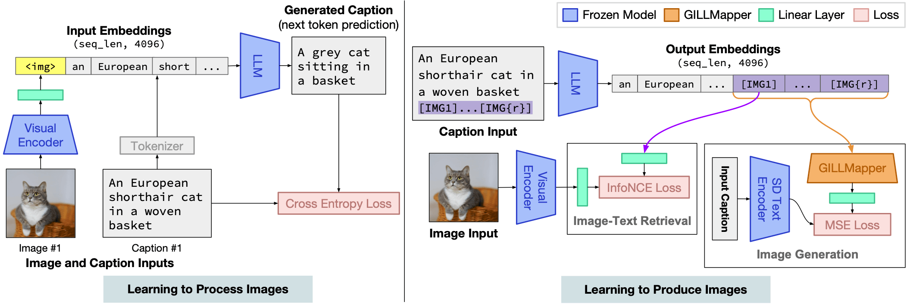

# Generating Images with Multimodal Language Models

<p align="center">

</p>

This repository will host the code and model weights for the GILL model. Coming soon!

[Paper](http://arxiv.org/abs/2305.17216) | [Project Webpage](https://jykoh.com/gill)


## Model and Usage
<p align="center">

</p>

GILL (Generating Images with Large Language Models) is capable of processing arbitrarily interleaved image-and-text inputs to generate text, retrieve images, and generate novel images. 


## Setup instructions


### Environment
Set up a new virtualenv, and install required libraries:
```
python -m venv venv
source venv/bin/activate
pip install -r requirements.txt
```

Add the `gill` library to PYTHONPATH:
```
export PYTHONPATH=$PYTHONPATH:/home/path/to/gill/
```

### Pretrained Checkpoints

The GILL model weights (linear layers and `[IMG]` embeddings) are small (around 96MB), and are included in this git repo. They will be in the `checkpoints/gill_opt/` folder after cloning. The checkpoint and model config in `checkpoints/gill_opt/` reproduce the main results reported in our paper.


### Precomputed Embeddings For Image Retrieval

For image retrieval, we provide the precomputed visual embeddings for Conceptual Captions images with valid URLs. They are stored at this [URL](https://drive.google.com/file/d/1e9Cimh2dpWN8Cbgx_mSR-954Dr-DS-ZO/view). These are used to enable the model to retrieve images. The embeddings take up around 3GB, and are compatible with both model configs we provide. Download the files and place `cc3m_embeddings_urls.npy` into the `checkpoints/gill_opt/` directory.

Note that you can still run the model without these, but it will not produce retrieved images. It will always generate novel images!


## Inference

Check out `GILL_example_notebook.ipynb` for examples on calling the model for inference. Several of the figures presented in the paper are reproduced in this notebook using greedy decoding of the model. Note that there may be minor differences in image outputs due to CC3M images being lost over time.

The notebook also shows how to use the model for generating images and generating text.


## Training

### Preparing CC3M

Our model is trained on the [Conceptual Captions](https://ai.google.com/research/ConceptualCaptions) dataset. After following the instructions on the website to download the captions and images, format it into a `.tsv` file as follows:

```
caption image
A picture of a cat  cat.png
Mountains  mountain.png
```
where each line contains the caption followed by the filename of the image files. Save these `.tsv` files into the `dataset/` folder (the default names expected are `cc3m_train.tsv` and `cc3m_val.tsv`). The repo contains two placeholder files with a few examples, and you will have to replace them with the appropriate data.

The corresponding image files should be saved in the `data/` directory. The directory can be changed with the `--image-dir` runtime flag.

### Precomputing Text Embeddings

In addition to downloading the images, GILL also requires the embeddings from the text encoder of Stable Diffusion to train. We precompute this ahead of time in order to improve training time throughput. To do so, run the following script:

```
python scripts/preprocess_sd_embeddings.py  datasets/cc3m_val.tsv data/cc3m/validation/clip_embs
```

This will precompute embeddings from the captions in `cc3m_val.tsv`, and save the results to `data/cc3m/validation/clip_embs`.

### Starting a Training Job

After preprocessing the data, we can finally start a training job with the following command line flag:

```
randport=$(shuf -i8000-9999 -n1)  # Generate a random port number
python -u main.py \
    --dist-url "tcp://127.0.0.1:${randport}" --dist-backend 'nccl' \
    --multiprocessing-distributed --world-size 1 --rank 0 \
    --dataset=cc3m  --val-dataset=cc3m \
    --exp-name='gill_exp' --image-dir='data/'  --log-base-dir='runs/' \
    --precision='bf16'  --print-freq=100
```
The default hyperparameters in `main.py` should reproduce our main results in the paper. We train on 2 A6000 GPUs for 48 hours. For GPUs with smaller memory available, you might need to reduce the batch size, enable gradient accumulation, or adjust hyperparameters to get good performance. You may also have to disable NCCL P2P with export NCCL_P2P_DISABLE=1 if you run into issues.

You can also run a small job on CPU, for testing purposes:
```
python -u main.py \
    --dataset=cc3m  --val-dataset=cc3m \
    --opt-version='facebook/opt-125m' --visual-model='openai/clip-vit-base-patch16' \
    --exp-name='fromage_exp'   --log-base-dir='runs/' \
    --batch-size=2  --val-batch-size=2  --precision='fp32'  --print-freq=1 \
    --epochs=2  --val_steps_per_epoch=2   --steps_per_epoch=2
```


## TODOs

- [ ] Add evaluation scripts for reproducing the results in the paper.
- [ ] Add web demo.
- [x] Add training code and instructions for training a new GILL model on CC3M.


## Citation

If you find this work useful, please consider citing:

```
@article{koh2023generating,
  title={Generating Images with Multimodal Language Models},
  author={Koh, Jing Yu and Fried, Daniel and Salakhutdinov, Ruslan},
  journal={arXiv preprint arXiv:2305.17216},
  year={2023}
}
```